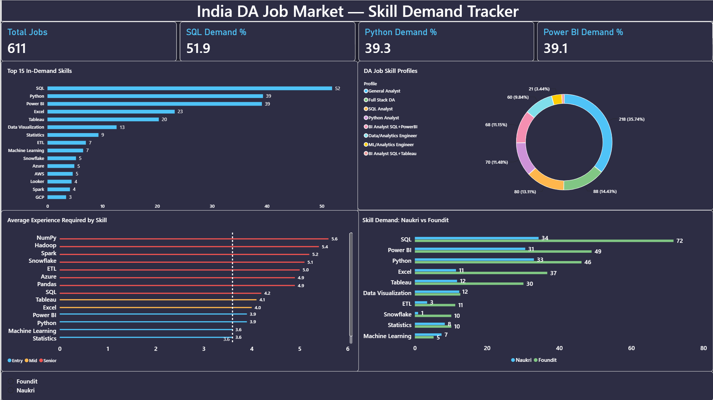

# 🔍 India DA Job Market — Tech Skill Demand Tracker

## 📊 Dashboard
[View Power BI Dashboard PDF](dashboard/Tech_skill_demand_dashboard.pdf)

---

## 📌 Project Overview

An automated data pipeline that scrapes real-time Data Analyst job postings from **Naukri.com** and **Foundit.in**, extracts in-demand technical skills using regex NLP, and analyzes skill demand patterns, co-occurrence clusters, and experience-based seniority profiles across the Indian job market.

**Core Business Question:** *What technical skills should an aspiring Data Analyst prioritize to maximize employability in India's current job market?*

**Sub-questions answered:**
- Which skills appear most frequently across DA job postings?
- Which skills cluster together — what combinations do employers want?
- Do Naukri and Foundit show different hiring patterns?
- Which skills appear in senior vs fresher roles (salary proxy)?

---

## 🛠️ Tools & Technologies

| Category | Tools |
|---|---|
| Web Scraping | Python, Playwright, BeautifulSoup |
| Data Processing | Pandas, NumPy, Regex |
| Analysis & EDA | Jupyter Notebook, Scipy |
| Visualization | Matplotlib, Seaborn, Power BI |
| Automation | Python Schedule library |
| Version Control | Git, GitHub |

---

## 📁 Project Structure

Tech-Skill-Demand-Tracker/
│
├── scrapers/
│ ├── naukri_scraper.py # Naukri.com scraper (Playwright + BS4)
│ ├── foundit_scraper.py # Foundit.in scraper (Playwright + BS4)
│ ├── run_all_scrapers.py # Master pipeline runner
│ ├── skill_extracter.py # Regex skill extraction
│ └── scheduler.py # Automated weekly scheduling
│
├── notebook/
│ └── market_analysis.ipynb # Full EDA and analysis
│
├── dashboard/
│ ├── dashboard_overview.png # Power BI dashboard screenshot
│ ├── dashboard_detail.png # Detailed view screenshot
│ └── Tech_skill_demand_dashboard.pdf # Full dashboard PDF
│
├── data/
│ └── data_source.md # Dataset description
│
├── utils/
│
├── .gitignore
├── LICENSE
└── README.md

---

## 📂 Data Collection

- **Sources:** Naukri.com (324 jobs) + Foundit.in (287 jobs)
- **Total dataset:** 611 Data Analyst job postings
- **Location:** India-only (filtered during scraping)
- **Period:** July 2026
- **Skills tracked:** 30 technical skills via regex pattern matching

**Scraping approach:**
- Playwright for JavaScript-rendered dynamic pages
- BeautifulSoup for HTML parsing
- Rate limiting with delays to avoid bot detection
- India-specific location filtering
- Deduplication via title+company composite key

---

## 🔍 Key Findings

### 1. Top Skills by Demand
- **SQL (51.9%)**, **Python (39.3%)**, **Power BI (39.1%)** dominate — appearing in roughly 1 in 2 Indian DA job postings
- Excel (23.2%) and Tableau (20.3%) form a secondary tier
- Cloud skills (AWS 4.6%, Azure 4.9%, GCP 3.4%) are barely mentioned — not required for DA roles in India

### 2. Skill Co-occurrence (What Goes Together)
- SQL + Python co-occur in **26.7%** of all postings
- SQL + Power BI co-occur in **26.4%** — virtually tied
- These three form the "holy trinity" of Indian DA roles
- Machine Learning is isolated — only 3.4% co-occurrence with SQL

### 3. Platform Comparison (Naukri vs Foundit)
- Foundit shows significantly higher SQL demand (71.7% vs 34.3%) — more enterprise/MNC roles
- Excel demand is 3x higher on Foundit (36.7% vs 11.4%) — traditional corporate roles
- Naukri skews toward startups and mid-size companies with more balanced requirements

### 4. Experience Seniority Profile
- **Entry-level skills:** Python (3.9 yrs avg), Power BI (3.9 yrs), Data Visualization (3.3 yrs)
- **Senior skills:** Spark (5.2 yrs), Snowflake (5.1 yrs), ETL (5.0 yrs), Azure (4.9 yrs)
- SQL (4.2 yrs) skews slightly senior despite high fresher demand

### 5. DA Job Skill Profiles
| Profile | % of Jobs |
|---|---|
| General Analyst | 35.7% |
| Full Stack DA (Python+SQL+Power BI) | 14.4% |
| SQL Analyst | 13.1% |
| Python Analyst | 11.5% |
| BI Analyst (SQL+Power BI) | 11.1% |

---

## 💡 Business Recommendations

1. **For job seekers:** Master SQL + Python + Power BI first — this combination covers 26%+ of all postings and is the most employable profile
2. **Ignore cloud for now:** AWS, Azure, GCP appear in under 5% of DA roles — not worth prioritizing for entry-level
3. **Platform matters:** Use both Naukri (startups, balanced roles) and Foundit (MNCs, enterprise) for job search — they show different hiring patterns
4. **Entry-level advantage:** Python and Power BI both have below-average experience requirements despite high demand — ideal for freshers

---

## ⚙️ Automation

The pipeline includes `scrapers/scheduler.py` configured to run weekly using Python's `schedule` library, automatically triggering the full scraping and analysis pipeline every Monday at 9 AM for continuous trend tracking.

---

## ⚠️ Data Limitations

- Data collected exclusively from Naukri.com and Foundit.in — other platforms like LinkedIn and Indeed were attempted but blocked or insufficient
- Salary data not available — experience used as a proxy for compensation level
- 106 jobs (17.4%) had 0 skills matched due to verbose skill descriptions on Foundit
- Snapshot data from July 2026 — skill demand may shift over time
- TimesJobs was attempted but excluded due to heavy duplicate listings

---

## 👤 Author

**Abhishek Sohal**
Mechanical Engineering Student | Punjab Engineering College, Chandigarh

